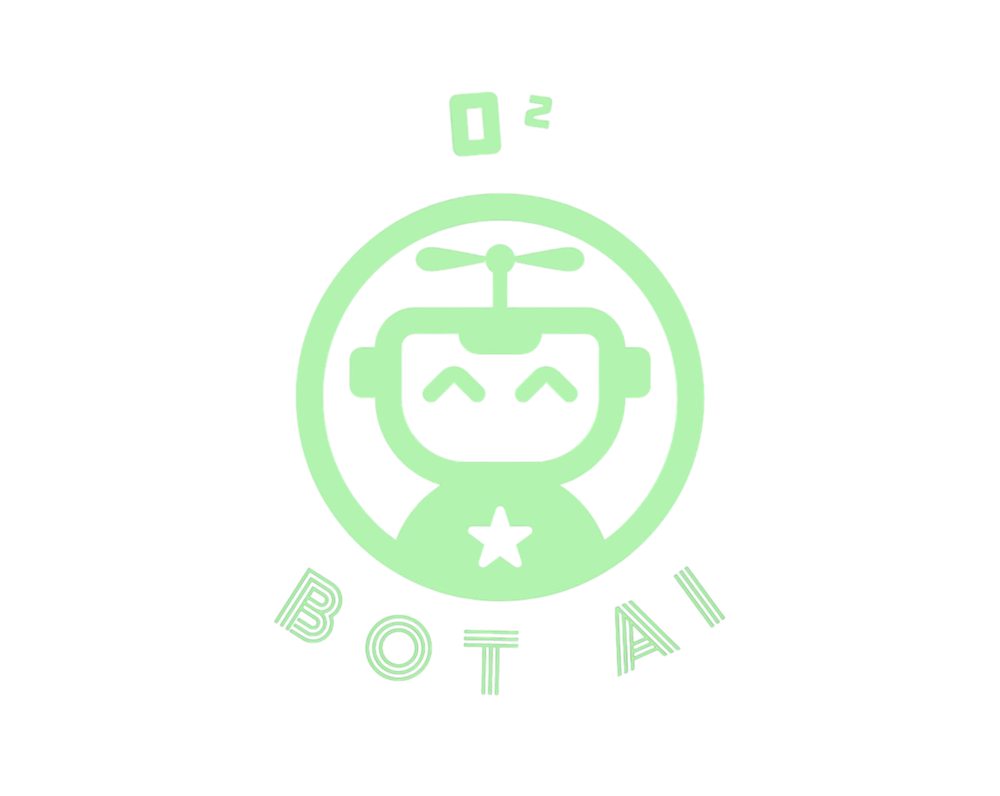

#  WhatsApp API Project

## Deskripsi

Proyek ini adalah API untuk mengelola interaksi dengan WhatsApp menggunakan `whatsapp-web.js`. API ini memungkinkan Anda untuk membuat dan mengelola grup WhatsApp, menambah dan menghapus peserta, serta mendapatkan informasi kontak dalam grup.

## Struktur Proyek
```
/whats-me
│
├── /src
│ ├── /controllers
│ │ ├── groupController.ts
│ │ ├── messageController.ts
│ │ └── sessionController.ts
│ ├── /routes
│ │ ├── groupRoutes.ts
│ │ ├── messageRoutes.ts
│ │ └── sessionRoutes.ts
│ ├── /services
│ │ └── sessionClient.ts
│ ├── app.ts
│ └── server.ts
│
├── /assets
│ └── logo.png
│
├── tsconfig.json
├── package.json
└── README.md
```


## Teknologi yang Digunakan

- **`Node.js`**: Platform runtime JavaScript.
- **`TypeScript`**: Superset JavaScript untuk pengembangan tipe statis.
- **`Express.js`**: Framework web untuk Node.js.
- **`whatsapp-web.js`**: Library untuk berinteraksi dengan WhatsApp Web API.
- **`canvas`**: Library untuk menggambar gambar di canvas.
- **`qrcode`**: Library untuk menghasilkan kode QR.

## Cara Instalasi

1. **Clone Repositori**

   ```bash
   git clone [https://github.com/BCIGRA/whats-me.git](https://github.com/BCIGRA/whats-me.git)
   cd whats-me
   ```

2. **Install Dependensi**

Pastikan Anda memiliki Node.js dan npm terinstal. Kemudian, jalankan perintah berikut untuk menginstal dependensi:
```bash
npm install
```
3. **Menjalankan Proyek**

Untuk menjalankan server:
```bash
npm start
```
Lisensi
Proyek ini dilisensikan di bawah MIT License.

Dan masih dalam pengembangan..
